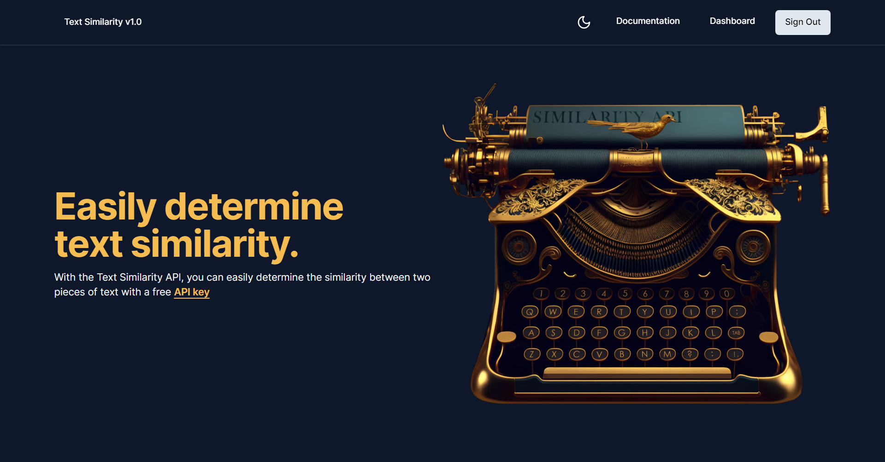
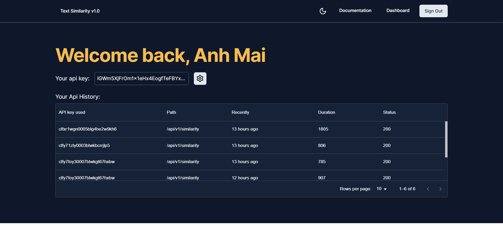
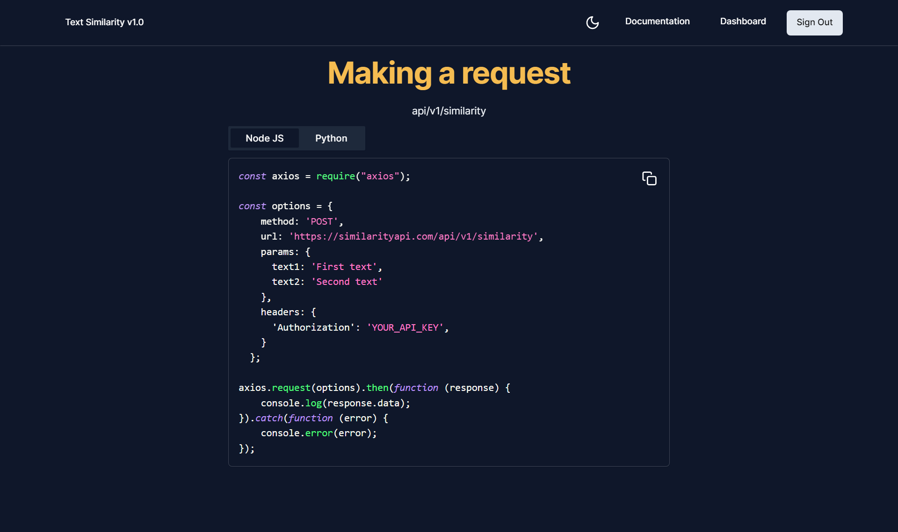
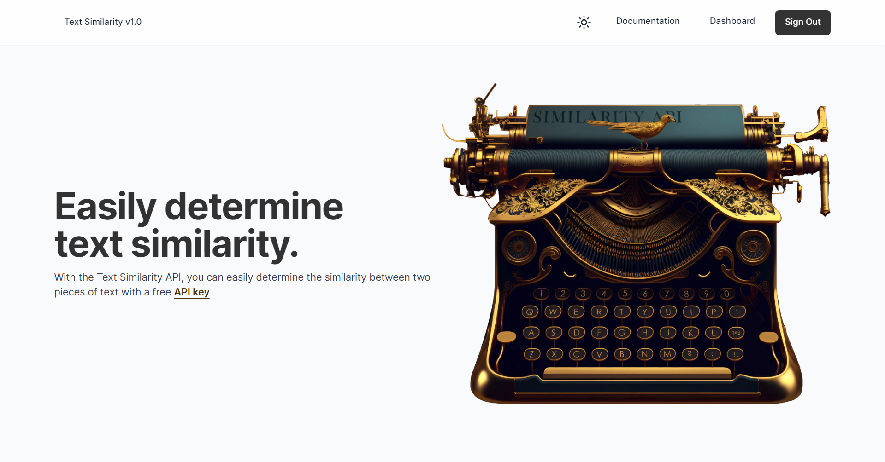
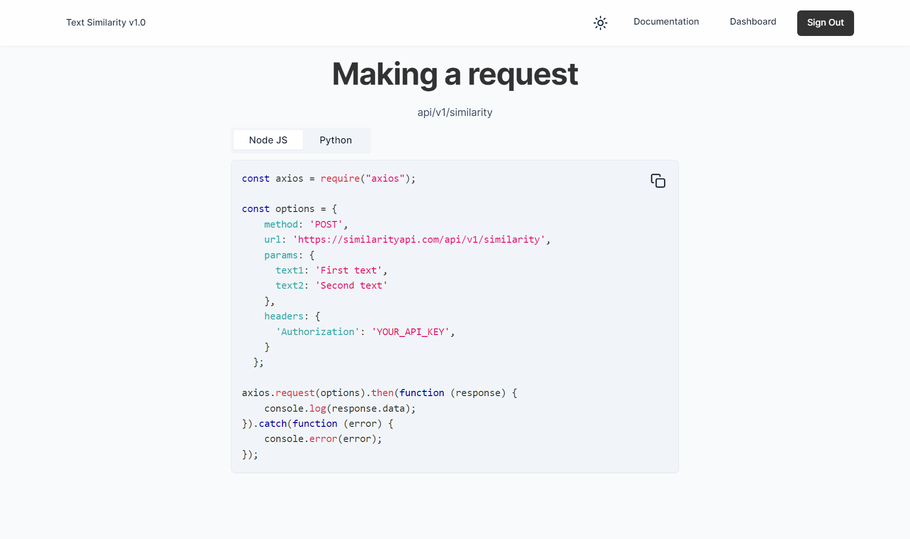
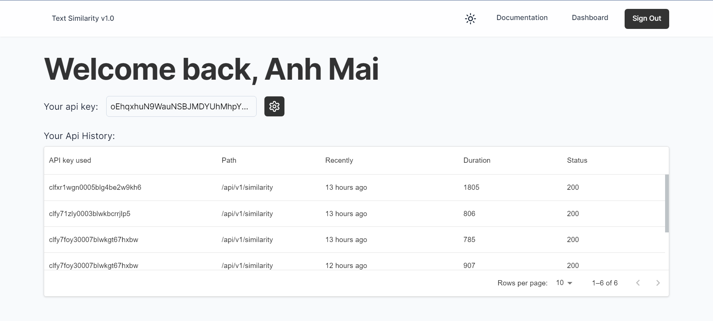
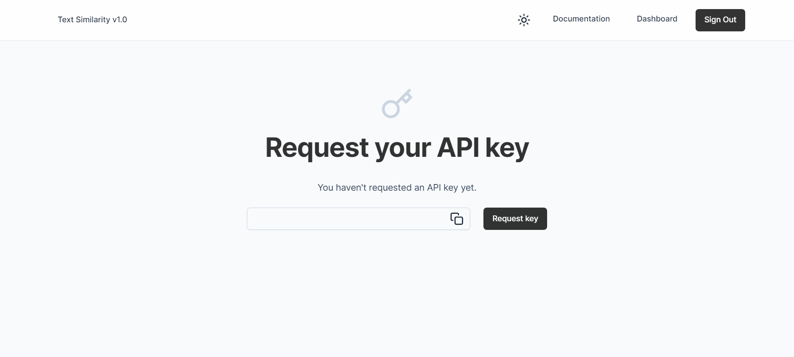
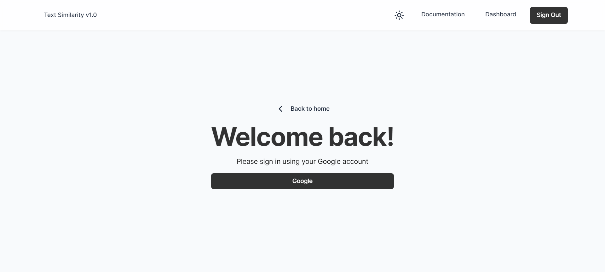

# Introduce

-   Website is remake from (https://www.similarityapi.com)
-   Test NextJs 13 in project
-   Frontend - Backend: NextJs-13
-   Database: Prisma
-   UI/UX: Tailwind Css
-   Demo:

# Features

-   Full responsive
-   Dark mode (Default: Light)
-   Authenticate: Next-auth

# Overview

-   Generate api keys and use that api key to compare the similarity between 2 text

# Preview

-   Dark mode

-   Light mode

